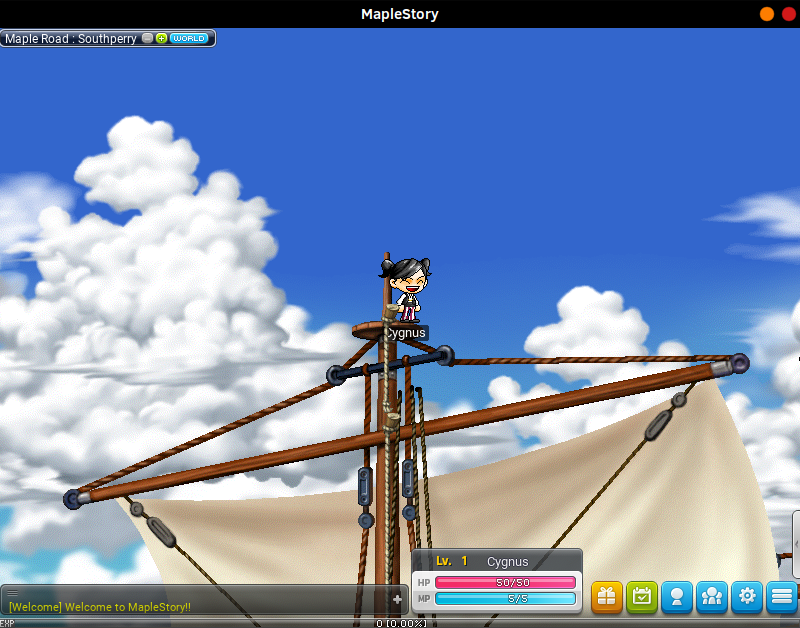
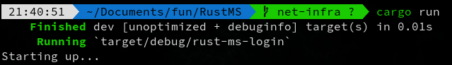
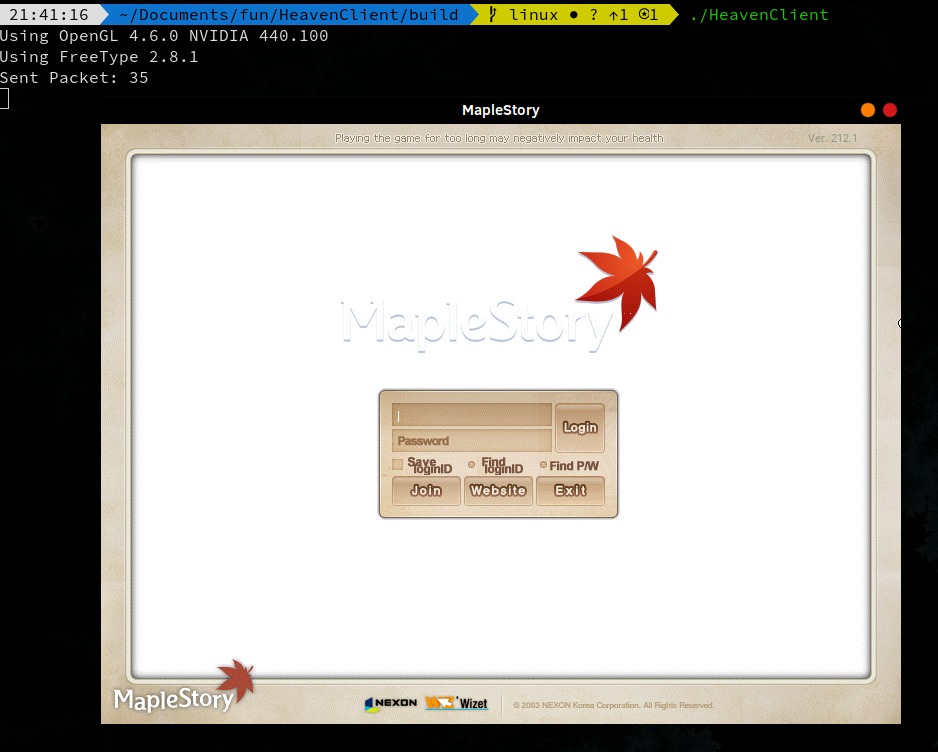
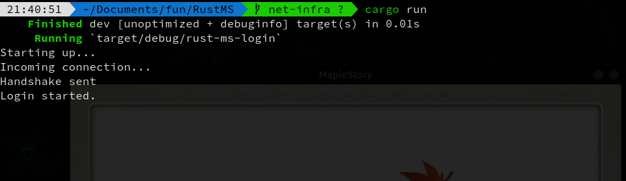
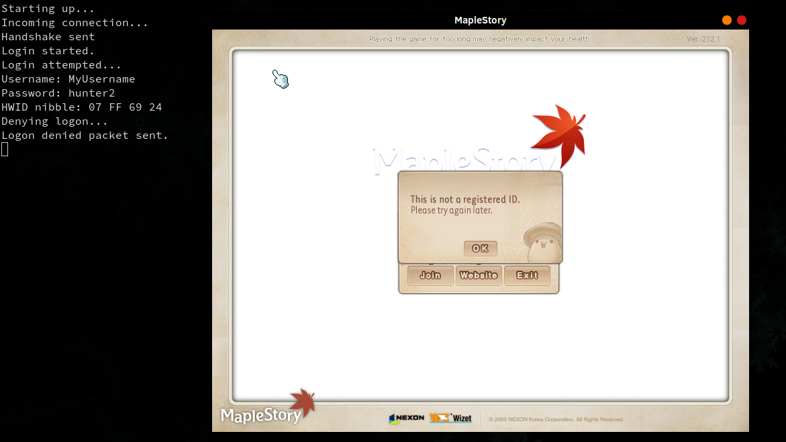

# RustMS 🍁

RustMS is an attempt at implementing the Maplestory server end from scratch in Rust. 

It's very work-in-progress and really only barely off the ground at this point, but it's been a fun evening/weekend side project so far!  

## Motivation
The motivation behind this project is two-fold:

When I started this project, I knew next to no Rust, however I was quite interested in learning it due to a general interest that I've always had in lower level languages. I've previously learned a bit of C, however I've only really used it in an academic setting (as well as to make this relatively bland [shell](https://github.com/neeerp/myShell) I made for fun). I thought Rust sounded interesting so I decided to start a fun project as a means of learning it. I'd also been trying to learn Vim for a while and thought caging myself in with it for this project (initially via the VS Code plugin and later neovim alone) would be fun.

The second motivation behind this project comes from the fact that Maplestory has a special place in my heart as the game that probably defined my childhood. I knew people had written and ran their own servers before but for the longest time it hadn't hit me that a lot of these servers had their source up on Github. Having looked at a few servers such as [HeavenMS](https://github.com/ronancpl/HeavenMS) and [Valhalla](https://github.com/Hucaru/Valhalla), I realized that I could probably try my hand at writing my own server too and that I could probably have quite a bit of fun with it.

## Overview
As of 23/08/2020, RustMS is still in a very early stage.

** Currently on hold while school's been very unforgiving; have plans for what to do next here that I will hopefully write down soon though! **

### Crates
The `crypt` crate provides the means for encrypting and decrypting packets using
Maplestory's custom AES algorithm as well as its secondary encryption algorithm
that's applied prior to AES. In particular, this library defines the `MapleAES`
object that is used to encrypt/decrypt and keep track of the encryption nonce for
a unidirectional stream of communication between the client and server. There is
also a module here that provides an interface for encrypting and decrypting
account passwords with bcrypt.

The `packet` crate provides a simple wrapper for our network packets, as well as an 
extension of the `Read` and `Write` IO traits that allow us to read and write various
data types to our packets, including little endian integers of different sizes and
length-headered strings.

The `db` crate provides connections to RustMS' PostgreSQL database, a representation 
of the database's schema, models and projections of the database entities, and 
the entities' respective data repositories. The models and data repositories live in 
domain specific modules, so, for instance, everything pertaining to user accounts 
can be found under the `account` module. The ORM we're using for RustMS is `diesel`.

The `net` crate is currently the largest crate and consists of two primary modules:
`io` and `packet`. The `io` module has methods and models that define our current
server infrastructure. Things like the entry point to a connection's main IO loop, 
as well as the methods and models for reading, decrypting, delegating, and sending 
packets are defined here. We also model the client connection and its state here. 
The `packet` module defines our packet handlers and builders for dealing with incoming 
packets from the client and building responses. There are two major submodules here, 
`build` and `handle` that perform the aforementioned duties. Currently, most of our 
server's actual logic resides here, however ideally we'd like to create a separate 
module (or perhaps add to the `db` crate's domain modules) to keep things organized and
DRY...

The current entry point of the project is the `rust-ms-login` crate. It listens for 
incoming connections on `localhost:8484` and delegates these connections to threads 
that instantiate a `Session` (performing an AES handshake in the process) and listen for 
IO until some kind of `NetworkError` (defined in the `net` crate) is returned and the 
client connection is closed.

### Functionality
Currently, RustMS consists solely of a reasonably functional Login Server. 

#### Encryption
Once a new client initiates a connection, the server responds with a handshake to 
exchange AES initialization vectors as well as some metadata about the server such 
as the client version that it expects. Any subsequent communication between the 
client and the server is encrypted with Maplestory's custom encryption (for lack of 
a better name) followed by Maplestory's custom AES encryption. Send and Receive data 
is encrypted using separate nonces (i.e. the initialization vectors and their 
subsequent mutations) that are both kept in sync between the client and server.

#### Account Creation/Login
Currently, one can create an account by attempting to log into an account that 
does not yet exist. The provided password is encrypted and the user/encrypted pw
combination is saved in the database. The first login will prompt the user to 
accept a TOS as well as select their gender before forwarding them to the world 
select... these two features are currently hardcoded to trigger however in the 
future they'll be controlled by a configuration property.

Existing accounts can be logged into as expected, and a successful login will 
forward you to the world select screen as expected.

Currently, the account PIN prompt is bypassed and PINs are not yet supported. In 
the future we'll implement this too (likely whenever we establish our architecture 
for handling multiple servers and moving sessions between them... this will likely 
require changes in how the client session is modeled, which will have a direct impact 
on pin logins). We'll be putting this behind a configuration property as well.

#### World Select
Currently, one may select a world from the world selection screen once they are 
logged in... Currently, there is only one world with one channel (though 3 appear
in the world select, the port of the one world with its one channel is hardcoded).

#### Character Selection/Creation/Deletion
Currently, character creation is supported to an extent. One may create persistent,
account linked characters that may be viewed on the character selection screen. 
These characters inherit some of the features that are selected during character 
creation such as gender, hair, and skin color, however equipment is ignored since 
this would require us to establish our model for character inventories as well as
character equiped items. This will most likely happen after we actually get a 
functioning game server.

Created characters also enforce uniqueness in their names, hence the check done 
at the end of the character creation flow is actually working. Currently this check 
is case sensitive, and that'll likely need to be fixed some time in the future.

Character deletion works and is instantaneous, so be careful (not as though your 
characters really matter at this stage of development anyway though).

PICs are currently disabled and will be implemented alongside PINs as mentioned
previously. They too will be toggleable via configuration.

#### Game World
Currently, one is able to log into the game world with their selected character.
At this point, the client is rerouted to the world server (one of the two binaries
built) and loads in with the selected character.

There's not really a whole lot to do in game currently, as very little is actually
implemented, however you can still walk around!

##### Maps
New characters initially spawn in the town of Amherst. From here, one may walk
around and enter portals to adjacent maps. If the player logs out, they will reappear
in the map they logged out from.

Note that currently, the default spawn point is selected for a given map, hence
the portal the player came out from probably won't line up with where the character
actually appears once they've loaded the map. This'll likely get addressed when
we develop a more concrete model for dealing with maps on the server side.

##### Keybinds
One may re-assign their keybinds as they normally would with the client. The selected
keybinds actually get saved and will be available if the player logs out and back
in later.

#### Database
RustMS is currently being backed by a standalone PostgreSQL server that can be seamlessly 
set up using the `docker-compose` file in the root of the project. The database's schema 
can be generated by running the `diesel` (our ORM of choice) migrations in the `db` crate.

## Demonstration
*This demonstration is out-dated and needs to be updated! For now, see the above 
overview for an idea of the implemented features!*

### Running the server
If you would like to run RustMS, clone the repository and run the project from the root with `cargo run` (make sure you have Rust and Cargo installed). You should see something akin to the following: 

On the first run of the server, you will likely have more output as dependencies will need to be downloaded and the project itself will build.

### Running the client
The server on its own is not particularly interesting without a client to communicate with it. At this point in time, this server is being developed with the [Heaven Client](https://github.com/HeavenClient/HeavenClient) in mind, however in theory any V83 Maplestory client that's pointed at `localhost` should work (no promises). Clone HeavenClient and follow the README's instructions on the branch corresponding to your operating system. Note that RustMS supports encryption and hence you shouldn't disable it when building the client.

Once you've built the client, run it:

In the server's console, you should see that the handshake completed successfully and the Login Start packet was received.

### Logging in
At the time of writing this, you can type in a username and password in the client's login window and submit. The server will parse the packet and echo it in the console.

## Roadmap
- [X] Develop a library for encrypting and decrypting packets in the form that the client expects
- [X] Develop a model for packets and packet IO
- [X] Develop basic infrastructure for sending and receiving packets to/from the client
- [X] Hook up a containerized database
- [X] Implement proper login and account creation flow
- [X] Implement character creation
- [X] Implement a parallel World Server
- [X] Login Sessions to transfer from Login to World Server
- [X] Save character keybinds from in game
- [X] In game portals to move between maps handled
- [ ] Revise and update roadmap (in progress)
